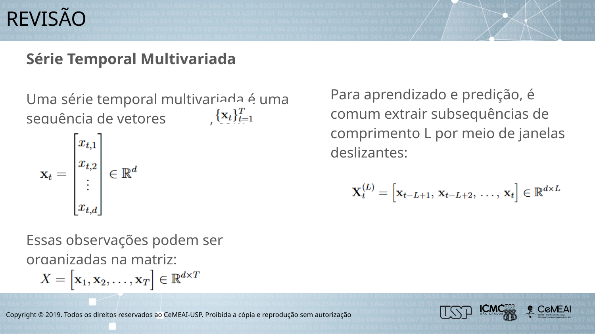
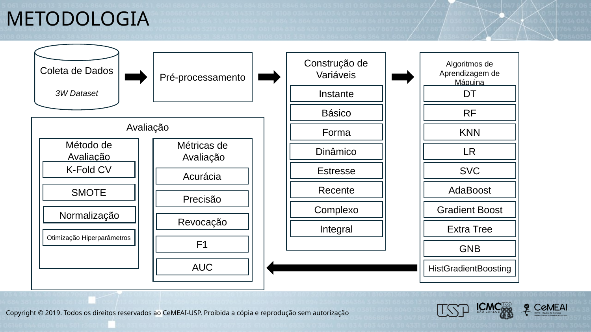
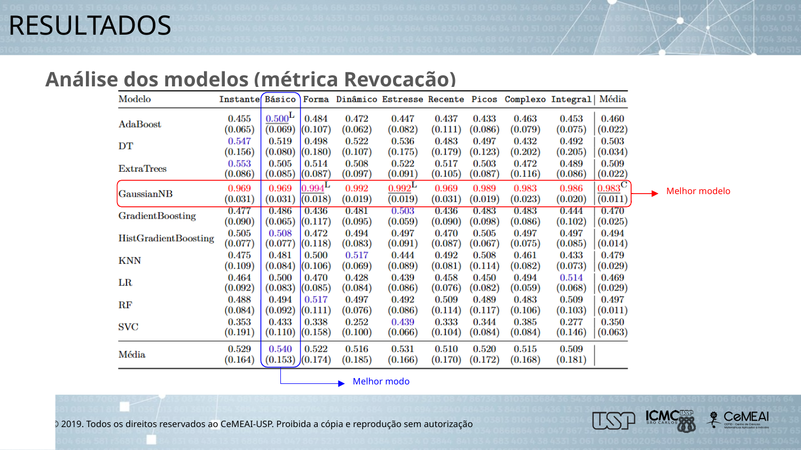
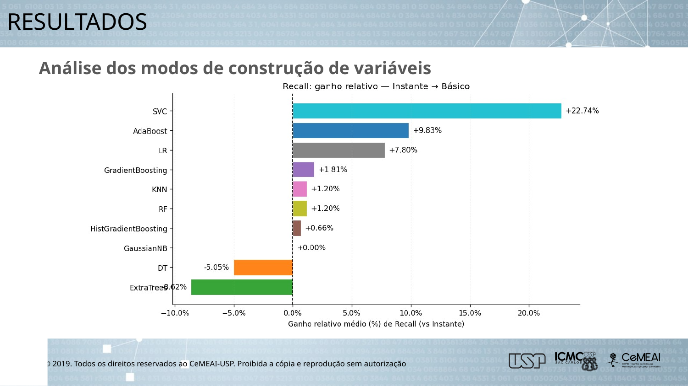
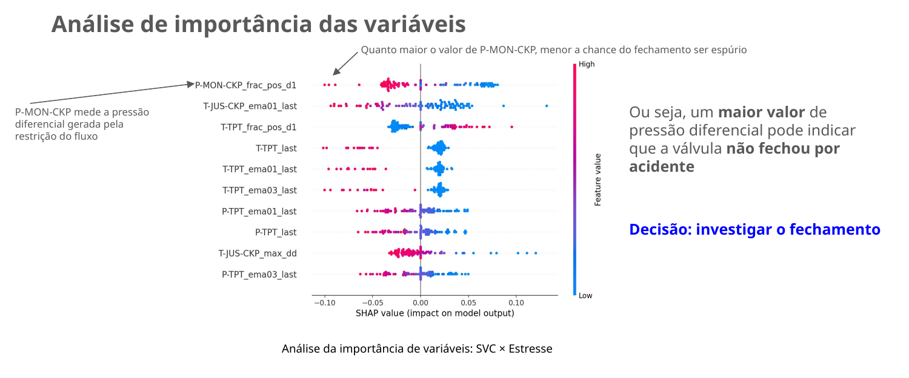
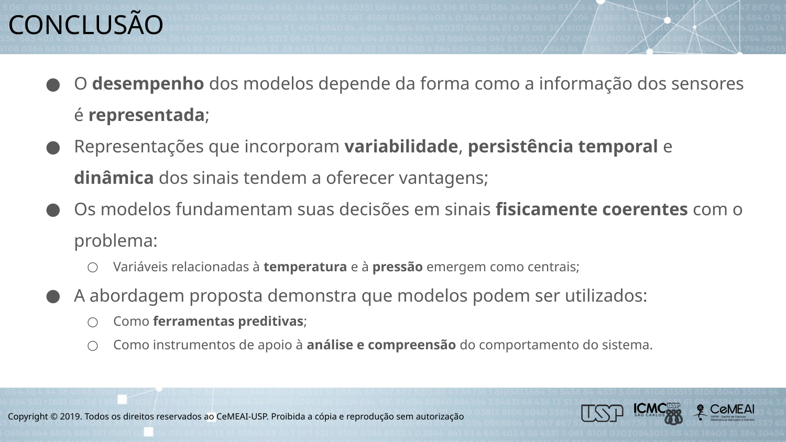

<p align="center">
  
</p>

Repositório do **Trabalho de Conclusão de Curso (TCC)** do **MBA em Ciência de Dados (CeMEAI/ICMC-USP)**  
https://cemeai.icmc.usp.br/MBA/

O objetivo é **identificar automaticamente fechamentos espúrios da válvula de segurança de fundo de poço (DHSV)** a partir de séries temporais multivariadas de sensores do **3W Dataset**:  
- 3W Project (repositório oficial): https://github.com/petrobras/3W  
- Artigo 3W Dataset 2.0.0 (descrição da versão pública): https://arxiv.org/abs/2507.01048

---

## 1) Contexto e motivação

O fechamento espúrio da DHSV é um evento operacional crítico: quando ocorre indevidamente, **interrompe a produção**, exige **intervenções corretivas** e pode elevar custos e riscos. A ideia deste projeto é usar **Ciência de Dados** para:

- **Antecipar** e **detectar** o evento com base em padrões em sensores (pressão, temperatura e variáveis de operação);
- **Comparar** algoritmos e diferentes formas de representar a janela temporal (feature engineering);
- **Explicar** as decisões dos modelos (SHAP/LIME) e conectar os achados a uma leitura física coerente.

> Nota: este repositório foca em um caso binário: **evento DHSV = classe 2 do 3W Dataset** (positivo) vs. demais janelas (negativo).

<p align="center">
  
</p>

---

## 2) Estrutura do repositório (visão geral)

A execução foi organizada para produzir artefatos **em ordem**, conectando claramente as pastas **`data/` → `resultados/` → `graficos/`**.

```text
.
├── data/                      # Entrada: 3W Dataset (CSV) organizado em subpastas
│   └── (subdirs)/.../*.csv
├── experimentos.py            # Etapa 1: cria janelas, extrai features, treina modelos e salva resultados
├── tabelas.py                 # Etapa 2: gera tabelas LaTeX (médias/DP, ganho vs Instante, rankings, significância)
├── graficos.py                # Etapa 3: gera gráficos a partir do TSV consolidado
├── resultados/                # Saída (gerada): métricas, plots por fold, XAI, TSV/JSON consolidados e tabelas LaTeX
│   ├── all_results_grid.tsv
│   ├── all_results_grid.json
│   ├── results_stream.tsv
│   ├── results_stream.jsonl
│   ├── FEAT-ORIG_summary.tsv
│   ├── FEAT-ORIG_STATS_summary.tsv
│   ├── ...
│   └── FEAT_<MODO>/           # (subpastas) CM/ROC e explicabilidade por fold/modelo
└── graficos/                  # Saída (gerada): gráficos + TSVs auxiliares (agregações e ganhos)
    ├── cv_aggregated.tsv
    ├── rel_gain_long.tsv
    ├── best_mode_per_model_metric.tsv
    ├── rel_gain_pivot_*.tsv
    └── *.png
```

---

## 3) Requisitos e instalação

Recomendado: Python 3.10+.

Dependências principais:
- `numpy`, `pandas`, `scikit-learn`
- `imbalanced-learn` (SMOTE)
- `matplotlib`
- `shap`, `lime`
- `tensorflow` (importado; modelos de deep learning estão mantidos como referência)

Exemplo de instalação:

```bash
python -m venv .venv
# Windows:
.venv\Scripts\activate
# Linux/Mac:
# source .venv/bin/activate

pip install -U pip
pip install numpy pandas scikit-learn imbalanced-learn matplotlib shap lime tensorflow
```

---

## 4) Dados de entrada (`data/`)

### 4.1 Como organizar os arquivos
O script `experimentos.py` lê o 3W Dataset como:

- `data/<subdiretorio>/*.csv`

Cada CSV precisa conter:
- coluna `class`
- colunas de sensores (por padrão):

```text
['P-PDG','P-TPT','T-TPT','P-MON-CKP','T-JUS-CKP','P-JUS-CKGL','T-JUS-CKGL','QGL']
```

> Se quiser alterar as variáveis, use `--vars` (veja a seção **6.1**).

### 4.2 Atenção: caminho do dataset no código
No código, o caminho padrão do dataset é definido por `DATASET_DIR_DEFAULT` dentro do `experimentos.py`.  
Se você estiver usando este repositório como projeto “standalone”, ajuste esse caminho para apontar para `./data`.

---

## 5) Como as janelas são criadas (rotulagem supervisionada)

O carregador (`preload_window_raw`) cria janelas com:
- `window_size = 180` amostras
- `step = 60` amostras
- positivo = janelas **após** cada ocorrência de `class == 2`
- negativo = janelas **antes** do evento e janelas de arquivos sem o evento

Isso gera um dataset supervisionado em formato:
- `X_seq`: `(N, T, D)` (sequência por janela)
- `y`: `(N,)` binário

---

## 6) Modos de construção de variáveis (feature engineering)

A mesma janela temporal pode ser representada de formas diferentes. No código, os modos (argumento `--feature-modes`) são:

| Código (CLI)        | Nome (tabelas) | Ideia resumida |
|---|---|---|
| `orig`              | Instante        | “estado final” (último valor de cada sensor) |
| `orig_stats`        | Básico          | estatísticas descritivas (média, DP, min, max, etc.) |
| `orig_stats2`       | Forma           | forma da distribuição (assimetria, curtose, etc.) |
| `orig_stats3`       | Dinâmico        | dinâmica do sinal (energia, RMS, autocorrelação etc.) |
| `orig_stats4`       | Estresse        | tendências/indicadores suavizados e “carga” operacional |
| `orig_stats5`       | Recente         | descritores com ênfase no comportamento recente (fim da janela) |
| `orig_stats6`       | Picos           | persistência em extremos (tempo acima de Q3, coefvar etc.) |
| `orig_stats7`       | Complexo        | descritores mais ricos e combinados |
| `mega_full`         | Integral        | concatenação mais extensa (“full”) |

## 7) Metodologia geral
<p align="center">
  
</p>

---

## 8) Como reproduzir (pipeline completo)

### 8.1 Etapa 1 — Rodar experimentos (`experimentos.py`)
Este script:
1) lê `data/` e cria janelas supervisionadas  
2) extrai features por modo  
3) roda **10-fold Stratified CV** e, **dentro de cada fold**, faz **GridSearchCV (cv=5, scoring=f1)**  
4) salva métricas + gráficos (CM/ROC) e explicabilidade (SHAP/LIME)  
5) consolida tudo em `resultados/all_results_grid.tsv`

Comando padrão:

```bash
python experimentos.py
```

Comandos úteis:

```bash
# Rodar apenas modos básicos (Instante/Básico/Forma)
python experimentos.py --feature-modes all

# Rodar vários modos
python experimentos.py --feature-modes orig orig_stats orig_stats6

# Rodar "todos os modos"
python experimentos.py --feature-modes all+

# Reduzir tempo (amostragem estratificada)
python experimentos.py --max-samples 600

# Ativar SMOTE (compare com "Original")
python experimentos.py --smote

# Escolher variáveis/sensores
python experimentos.py --vars P-PDG P-TPT T-TPT QGL
```

#### Entradas e saídas do `experimentos.py` (em ordem)
**Entrada**
- `data/**/**/*.csv` (3W Dataset)

**Saídas (raiz em `resultados/`)**
- `results_stream.tsv` / `results_stream.jsonl`  
  *Streaming* com 1 linha por (modo × modelo × fold). Útil para acompanhar execução longa.
- `FEAT-<MODO>_summary.tsv` / `.json`  
  **média e desvio padrão** por classificador (agregando os 10 folds).
- `all_results_grid.tsv` / `.json`  
  tabela consolidada (base para gráficos e tabelas finais).

**Saídas (por modo em `resultados/FEAT_<MODO>/`)**
- `*_CM.png` (matriz de confusão por fold)
- `*_ROC.png` (curva ROC por fold)
- `*_SHAP_*.png` (beeswarm e bar; 1º fold por modelo)
- `*_LIME_example.html` (exemplo local; 1º fold por modelo)
- `*_surrogate_fidelity.txt` (fidelidade de uma árvore rasa como explicação)

#### Formato do consolidado `all_results_grid.tsv`
Colunas:
- `feat_mode` (orig, orig_stats, ...)
- `scenario` (Original ou SMOTE)
- `model` (DT, RF, KNN, LR, SVC, AdaBoost, GradientBoosting, ExtraTrees, GaussianNB, HistGradientBoosting)
- `variant` (ex.: `grid_best_fold7`)
- métricas: `accuracy`, `precision`, `recall`, `f1`, `auc`

---

### 8.2 Etapa 2 — Gerar tabelas LaTeX (`tabelas.py`)
Lê:
- `resultados/all_results_grid.tsv`
- `resultados/FEAT-*_summary.tsv`

Escreve:
- `resultados/tabelas_metricas_latex.txt` (pronto para colar no TCC)

```bash
python tabelas.py
```

O LaTeX gerado contém:
- **Tabelas absolutas** (média ± DP) por métrica (Acurácia, Precisão, Revocação, F1, AUC)
- **Tabelas de ganho relativo (%) vs Instante**
- **Rankings** por classificador (absoluto e ganho)
- Marcas de **significância** (L/C), com correções para múltiplas comparações

---

### 8.3 Etapa 3 — Gerar gráficos (`graficos.py`)
Lê o TSV consolidado e produz gráficos e TSVs auxiliares em `graficos/`.

```bash
python graficos.py --tsv resultados/all_results_grid.tsv --outdir graficos
```

Saídas em `graficos/`:
- `cv_aggregated.tsv`  
  agregação por (modo, cenário, modelo) com médias/DP.
- `rel_gain_long.tsv`  
  ganho (%) por (métrica, modelo, modo) usando *ratio-of-means* pareado por fold (compatível com as tabelas).
- `best_mode_per_model_metric.tsv`  
  melhor modo por (métrica, modelo).
- `rel_gain_pivot_*.tsv`  
  pivot (modelos × modos) com ganhos médios (%).
- `*.png`  
  gráficos de desempenho absoluto e ganho relativo.

---

## 9) Resultados (exemplos)

As figuras abaixo foram exportadas da apresentação do TCC (`Apresentação TCC.pptx`) e ilustram o tipo de análise produzido por este repositório.

**(a) Revocação — melhor modelo e melhor modo (exemplo):**  
<p align="center">
  
</p>

**(b) Ganho relativo em Revocação — Instante → Básico (exemplo):**  
<p align="center">
  
</p>

**(c) Interpretabilidade (SHAP) — variáveis centrais (exemplo):**  
<p align="center">
  
</p>

De forma geral (como discutido no TCC):
- ensembles baseados em árvores tendem a ser **robustos** em métricas globais (Acurácia/AUC);
- modelos probabilísticos como **GaussianNB** podem maximizar **Revocação** (sensíveis ao evento), com possível aumento de falsos positivos;
- modos que capturam **dinâmica**, **estresse** e **picos/persistência** frequentemente trazem ganhos sobre o modo **Instante**.

<p align="center">
  
</p>

---

## 10) Como citar este repositório

Se este repositório for utilizado como base, cite como material suplementar do TCC (ajuste para ABNT/APA):

> PIMENTEL, B. A. *Predição de Fechamento Espúrio de Válvula de Segurança em Poços de Petróleo.* Repositório GitHub, 2026.
